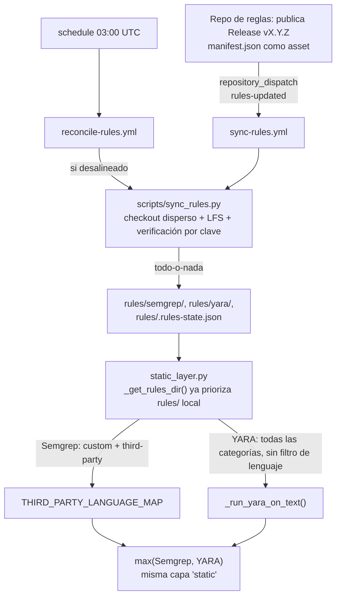

# Registro de progreso - Pablo Jiménez Castro

## Metadatos

- Responsable: Pablo Jiménez Castro
- Última actualización: 2026-08-10
- Estado general: Componentes funcionales y con tests unitarios propios, pero con un defecto de integración confirmado (incompatibilidad de claves `"deps"` vs `"dependencies"`) que impide que `deps_layer.py` participe en el análisis con la configuración por defecto, y que lo excluye siempre del cortocircuito. Ver §2.2, §2.3 y §3. **Adenda 2026-08-08 (§2.5):** implementada, verificada en producción real y documentada la integración consumidora del repo privado de reglas (`sync-rules.yml`, `reconcile-rules.yml`, `scripts/sync_rules.py`) y su conexión con `static_layer.py` (third-party Semgrep + YARA, antes sin usar pese a estar ya sincronizadas). **Adenda 2026-08-10 (§2.2):** cerrado el hueco de cobertura de tests de `_has_new_dependencies` (commit `de963d1`, rama `test/shortcircuit-dependency-coverage`); de paso se confirma que `DEPENDENCY_MANIFEST_FILENAMES` ya no cubre cuatro ecosistemas sino seis (se sumaron `go.mod` y `composer.json` en el commit `792ed33`, posterior a la redacción original de este documento) — el propio TODO de "cuatro ecosistemas" estaba desactualizado respecto al código. **Nota aparte, fuera del alcance de esta pasada:** el mismatch de clave `"deps"`/`"dependencies"` que este documento marca abajo como "Confirmado, prioridad alta" y bloqueante ya no lo es — el código actual de `shortcircuit.py` define `_PARTIAL_LAYER_NAMES = ("static", "dependencies", "deps", "vulnerabilities", "reputation")`, incluyendo ya la clave canónica `"dependencies"` (corregido en el commit `222a3f9`, "unificar claves de capas", 2026-08-07 — anterior incluso a la "Última actualización" previa de este documento). El resto de §2.2, §5 y §6 que describen este bug como abierto no se ha revisado a fondo ni corregido en esta pasada; queda como deuda documental pendiente de una revisión dedicada.
- Última revisión realizada por: Pablo Jiménez Castro (análisis e implementación asistidos por Claude Code, contraste directo contra el código fuente actual y contra los repos reales en producción, no solo contra documentación previa)
- Componentes registrados: CLI (`watchgate/cli.py`), Cortocircuito / shortcircuit (`watchgate/core/shortcircuit.py`), Capa de dependencias / deps_layer (`watchgate/core/layers/deps_layer.py`, `watchgate/core/layers/_shared.py`), Integración con el repo de reglas y capa estática (`.github/workflows/sync-rules.yml`, `.github/workflows/reconcile-rules.yml`, `scripts/sync_rules.py`, `scripts/rules_hash.py`, `watchgate/core/layers/static_layer.py` — §2.5)

---

# 1. Resumen general

Este registro cubre, con el alcance solicitado, tres componentes de WatchGate: la CLI (`cli.py`), el cortocircuito de extremo (`shortcircuit.py`) y la capa de dependencias (`deps_layer.py` + `_shared.py`). No se documentan aquí `static_layer.py`, el dashboard ni el resto de capas salvo lo estrictamente necesario para entender la integración (§2.4).

**Adenda 2026-08-08:** el alcance se amplía con un componente nuevo (§2.5), fuera del reparto original de `plan_tareas_equipo.md` por ser infraestructura posterior: la integración consumidora del repo privado de reglas `pablojimz/Repo-reglas-SEMGREP-y-YARA` (workflows de sincronización + verificación de integridad) y su conexión con `static_layer.py` (que hasta este momento sí estaba fuera del alcance del documento, y ahora se documenta específicamente en lo tocado por este trabajo).

**Sobre el reparto de responsabilidad:** `docs/planificacion/plan_tareas_equipo.md` registra que Pablo Ayllón García y Pablo Jiménez Castro **intercambiaron sus líneas** respecto al reparto original. En la tabla vigente de ese documento:

- Línea 1 (núcleo/orquestador/CLI: `diffparser`, `aggregator`, `orchestrator`, `cost_control`) está asignada formalmente a **Pablo Ayllón García**.
- Línea 3 (`static_layer`, `deps_layer`, dashboard) está asignada formalmente a **Pablo Jiménez Castro**.
- `shortcircuit.py` no aparece en ninguna de las tres líneas de la Fase 1: se implementó en la Fase 2 (integración, "opcional/objetivo ampliado").

Es decir: según la planificación vigente del proyecto, `cli.py` y `shortcircuit.py` no son responsabilidad formal de Pablo Jiménez Castro, y ya están documentados en detalle desde la perspectiva de Pablo Ayllón García en [`docs/progreso/progreso_pablo_ayllon_garcia.md`](progreso_pablo_ayllon_garcia.md). Se documentan también aquí porque así lo pide el alcance de esta tarea y porque `deps_layer.py` — sí propio de esta línea — depende de `_shared.py` y se relaciona directamente con `shortcircuit.py` (ambos leen `DEPENDENCY_MANIFEST_FILENAMES`); entenderlos juntos es necesario para el hallazgo de §2.2/§2.3/§3. Donde este análisis coincide con el registro de Ayllón García se referencia sin repetir todo el detalle; donde añade información nueva o corrige algo, se indica explícitamente.

**Sobre la autoría real en git:** el histórico de commits de estos tres ficheros no está firmado por las tres identidades "Pablo Ayllón García / Javier Martín Jurado / Pablo Jiménez Castro" que usan los documentos de planificación, sino por las identidades de git `javiermartinj` (`javiermartinjurado12123@gmail.com`), `elpeloncho` (`peloncho018@gmail.com`) y, en un único commit que toca `deps_layer.py` (`1fe70ef`, corrección de compatibilidad de `datetime.UTC`), `pablojimz` (`pablojimenezcastro@uma.es` — la identidad de quien firma este registro). La correspondencia entre `javiermartinj` y Javier Martín Jurado es razonable por nombre y correo; la correspondencia entre `elpeloncho` y Pablo Ayllón García (asumida en `progreso_pablo_ayllon_garcia.md`) **no se puede confirmar solo leyendo el repositorio** — se marca como **pendiente de confirmar** en vez de darla por buena.

**Sobre el entorno de verificación:** el proyecto declara `requires-python = ">=3.11"` (`pyproject.toml`). El intérprete disponible en esta máquina de análisis es Python 3.10.0 y no hay `poetry` instalado, así que **no ha sido posible ejecutar `pytest` ni `make test` en este entorno** para confirmar en vivo el recuento de tests en verde que citan otros documentos del proyecto (p. ej. "244 tests"). Todo lo que sigue sobre comportamiento de test se basa en lectura directa del código de test, no en una ejecución real aquí; se marca como pendiente de confirmar en un entorno con Python 3.11+.

---

# 2. Componentes analizados

## 2.1 CLI

### Información básica

- Responsable formal (plan de tareas vigente): Pablo Ayllón García (Línea 1).
- Ubicación en el proyecto: `watchgate/cli.py`
- Estado actual: Implementado y con tests de camino feliz; sin tests de rutas de error.
- Última revisión: 2026-08-07 (esta revisión)
- Nivel de madurez: Funcional para el caso de uso principal (`watchgate analyze` / `watchgate rag reindex` contra un repo Git local bien formado). No verificado en producción/CI real desde este análisis.

### Historial de cambios

| Fecha | Cambio realizado | Motivo | Responsable (según git log) |
|------|------------------|--------|-------------|
| 2026-07-29 | Commit `078e769`: reestructuración del repo y Fase 0 (contrato compartido `models.py`/`base.py`) | Preparar el contrato común antes de poder escribir `cli.py` real | javiermartinj |
| 2026-08-05 | Commit `417fff1`: "actualizaciones de estado de desarrollo, cli, feedback y indexer" — implementación real de `_cmd_analyze`/`_cmd_rag_reindex` | Pasar de esqueleto/`--help` a ejecución E2E del pipeline | elpeloncho |
| 2026-08-05 | Commit `e20e8c3`: "capa de dependencias" (toca `cli.py` de forma colateral al integrar `deps_layer`) | Cablear la nueva capa en el flujo ya existente | elpeloncho |
| 2026-08-06 | Commit `f048f1c`: "Implementar el adaptador de GitHub Action" (toca `cli.py`/`pipeline.py` para compartir orquestación) | Evitar duplicar el wiring CLI vs. GitHub Action | javiermartinj |

### Estado actual

- **Funcionalidades implementadas** (verificado leyendo `watchgate/cli.py` directamente):
  - Subcomando `watchgate analyze`: argumentos `--base`, `--head`, `--repo-path` (default `.`), `--config` (default `.watchgate.yml`), `--pr-id`, `--repo`, `--author-login`, `--format {comment,json}` (default `comment`), `--output`.
  - Subcomando `watchgate rag reindex`: reconstruye el índice ChromaDB vía `build_index()`, con `--index-path`.
  - `_cmd_analyze` delega todo el análisis en `run_full_analysis()` (`watchgate/core/pipeline.py`) — no reimplementa orquestación propia.
  - Código de salida: `1` si `config.block_on_red` es `True` y `aggregated.semaforo == Semaforo.ROJO`; `0` en cualquier otro caso (incluye AMARILLO y VERDE, y también ROJO si `block_on_red` es `False`).
  - Sin subcomando, `main([])` imprime la ayuda y devuelve `0` (no falla).
- **Funcionalidades pendientes / no cubiertas**:
  - No hay manejo de errores propio alrededor de `load_config()` ni `parse_diff()` en `_cmd_analyze` (ver "Problemas detectados").
  - No construye `metadata["reputation"]`: la CLI nunca puede alimentar `ReputationLayer` con datos reales (ver "Problemas detectados").
  - No hay flags de verbosidad/logging, ni autocompletado de shell.
- **Partes completas**: parseo de argumentos, invocación del pipeline compartido, formateo Markdown/JSON, volcado opcional a fichero, código de salida para CI/CD.
- **Limitaciones conocidas**: la propia CLI no valida que `--base`/`--head` sean referencias Git válidas antes de invocar `parse_diff` — cualquier error ahí se propaga tal cual (ver más abajo).

### Arquitectura e integración

- **Responsabilidad del componente**: punto de entrada de línea de comandos para ejecuciones locales/CI que ya tienen un checkout Git disponible.
- **Módulos con los que interactúa**:
  - `watchgate.config.load_config` — carga `.watchgate.yml` (o defaults si no existe).
  - `watchgate.core.diffparser.parse_diff` — construye el `NormalizedDiff` a partir de un repo Git local.
  - `watchgate.core.pipeline.run_full_analysis` — ejecuta cortocircuito + orquestación + agregación (no está en el alcance de este documento, ver `progreso_pablo_ayllon_garcia.md` §2.4.1 para su detalle completo).
  - `watchgate.core.comment_template.render_comment` — formatea el resultado en Markdown cuando `--format comment`.
  - `watchgate.core.rag.indexer.build_index` / `DEFAULT_INDEX_PATH` — subcomando `rag reindex`.
  - `watchgate.core.layers` (import con `# noqa: F401`) — necesario únicamente para forzar el registro de las capas concretas en `LAYER_REGISTRY` antes de que el orquestador las busque por nombre.
- **Dependencias**:
  - Internas: `watchgate.config`, `watchgate.core.diffparser`, `watchgate.core.pipeline`, `watchgate.core.comment_template`, `watchgate.core.models`, `watchgate.core.rag.indexer`, `watchgate.core.layers`.
  - Externas: `argparse`, `sys`, `pathlib` (librería estándar).
- **Flujo de comunicación**: argumentos de consola → `argparse.Namespace` → `NormalizedDiff` + `dict` de metadata → `run_full_analysis()` → `AggregatedResult` → texto (Markdown/JSON) por `stdout` y, opcionalmente, a fichero.
- **Entradas y salidas**:
  - Entradas: `sys.argv`.
  - Salidas: texto por `stdout`; fichero opcional; código de salida entero (`0`/`1`).

### Análisis técnico

- **Ficheros principales**: `watchgate/cli.py` (126 líneas).
- **Clases importantes**: ninguna — módulo funcional puro.
- **Funciones relevantes**:
  - `_build_parser() -> argparse.ArgumentParser`
  - `_cmd_analyze(args) -> int`
  - `_cmd_rag_reindex(args) -> int`
  - `main(argv=None) -> int`
- **Flujo de ejecución**: `main()` → `_build_parser().parse_args()` → dispatch por `args.subcommand` → `_cmd_analyze` o `_cmd_rag_reindex` → salida por consola/fichero → código de retorno.
- **Flujo de datos**: `sys.argv` → `argparse.Namespace` → (`NormalizedDiff`, `dict[str, object]`, `WatchGateConfig`) → `AggregatedResult` → `str`.
- **Decisiones de diseño observadas en el código**: la CLI delibera­damente no contiene lógica de orquestación propia — todo vive en `pipeline.py` para poder compartirse con el adaptador de GitHub Action. Es una decisión correcta de desacoplamiento; el coste es que cualquier bug de wiring en `pipeline.py`/`config.py` (ver §2.3 y §3) se manifiesta también aquí sin que `cli.py` tenga forma de detectarlo por sí sola.

### Dependencias

#### Dependencias internas
- `watchgate.config`
- `watchgate.core.diffparser`
- `watchgate.core.pipeline`
- `watchgate.core.comment_template`
- `watchgate.core.models`
- `watchgate.core.rag.indexer`
- `watchgate.core.layers` (efecto secundario de registro)

#### Dependencias externas
- `argparse`, `sys`, `pathlib` (librería estándar de Python)

#### Interfaces utilizadas
- `run_full_analysis(diff, metadata, config) -> AggregatedResult`
- `build_index(index_path) -> int`

### Problemas detectados

- **Sin manejo de errores en `_cmd_analyze`** (confirmado leyendo el código: no hay ningún `try`/`except` en `_cmd_analyze` ni en `main`). Si `load_config()` lanza (`.watchgate.yml` mal formado, `TypeError` explícito por diseño de `config.py`) o si `parse_diff()` lanza (SHA inexistente, ruta que no es un repo Git, etc.), la excepción se propaga sin capturar y el usuario ve un traceback de Python en vez de un mensaje de error controlado y un código de salida predecible. Contrasta con el resto del sistema, donde `safe_analyze` (`layers/base.py`) garantiza que un fallo de una capa nunca tumba el proceso: ese aislamiento no cubre la fase de *entrada* (config + diff), solo la fase de análisis por capas.
- **`metadata["reputation"]` nunca se construye en `cli.py`**: `run_full_analysis`/`ReputationLayer` esperan una señal de reputación ya resuelta en `metadata`; la CLI solo rellena `pr_id`, `repo`, `author_login`. Como consecuencia, ejecutar `watchgate analyze` desde la línea de comandos **nunca puede activar `ReputationLayer` con datos reales** (se omite sola, sin error, porque no encuentra la clave) — la CLI solo tiene sentido pleno para las capas `static`/`deps`/`semantic`, no para `reputation`. Esto no está documentado en el `--help` ni en el docstring del módulo.
- **Cobertura de test limitada a camino feliz**: `tests/unit/test_cli.py` tiene 6 tests, todos con un repo Git válido y argumentos correctos (`test_cli_help_returns_zero`, `test_cli_no_args_prints_help`, `test_cli_analyze_comment_format`, `test_cli_analyze_json_format`, `test_cli_analyze_saves_output_to_file`, `test_cli_rag_reindex`). No hay ningún test que ejercite `--repo-path` inexistente, `--base`/`--head` inválidos, ni `.watchgate.yml` corrupto — es decir, el problema anterior no está cubierto por tests, por lo que una regresión ahí no la detectaría la suite actual.
- **Duplicación de código**: ninguna detectada.
- **Complejidad innecesaria**: ninguna; el fichero es corto y de responsabilidad única.

### Posibles mejoras

- Envolver `load_config()` y `parse_diff()` en `_cmd_analyze` con manejo explícito de errores (mensaje por `stderr` + código de salida distinto de `0`/`1`, p. ej. `2`, para distinguir "análisis completado con veredicto ROJO" de "la CLI no pudo ni empezar a analizar").
- Añadir tests que cubran `--repo-path` inválido, SHAs inexistentes y `.watchgate.yml` mal formado.
- Documentar explícitamente en `--help` (o en un mensaje al vuelo) que `watchgate analyze` ejecutado en local no alimenta `ReputationLayer` con datos reales, para que no se interprete un `risk_score` de reputación en `0`/omitido como "cuenta sin riesgo" cuando en realidad es "sin datos".
- Autocompletado de shell (mejora de baja prioridad, ya apuntada en `progreso_pablo_ayllon_garcia.md`).

### Estado para otros desarrolladores

- **Partes estables**: contrato de argumentos de `analyze`/`rag reindex`, delegación en `run_full_analysis`.
- **Partes a revisar antes de modificar**: cualquier cambio en `_cmd_analyze` debe decidir explícitamente qué pasa si `load_config`/`parse_diff` fallan — hoy es "lo que Python decida al propagar la excepción", no una decisión de producto.
- **Conocimientos necesarios**: `argparse`, contrato de `WatchGateConfig`/`NormalizedDiff`.
- **Tareas pendientes**: ver "Posibles mejoras".

### Próximos pasos

- Cerrar el hueco de manejo de errores antes de exponer la CLI en un pipeline de CI de terceros (hoy un `.watchgate.yml` mal formado tumba el job entero con un traceback, no con un mensaje accionable).

---

## 2.2 shortcircuit

### Información básica

- Responsable formal (plan de tareas vigente): no asignado a ninguna de las tres líneas de Fase 1; implementado en Fase 2 como "opcional/objetivo ampliado" (§11 de la spec). Documentado también en `progreso_pablo_ayllon_garcia.md`.
- Ubicación en el proyecto: `watchgate/core/shortcircuit.py`
- Estado actual: Implementado, con 13 tests unitarios propios que cubren los casos de decisión documentados en el propio módulo — pero con un defecto de integración confirmado (ver más abajo) que hace que, en la práctica, **la capa de dependencias nunca participa en el cálculo del cortocircuito**, contradiciendo el propio código del módulo.
- Última revisión: 2026-08-07 (esta revisión)
- Nivel de madurez: Lógica interna sólida y bien testeada de forma aislada; integración con `deps_layer.py` rota.

### Historial de cambios

| Fecha | Cambio realizado | Motivo | Responsable (según git log) |
|------|------------------|--------|-------------|
| 2026-07-29 | Commit `078e769`: creación junto con la Fase 0 | Contrato compartido inicial | javiermartinj |
| 2026-08-05 | Commit `df2fdec`: "refactor a aggregator, `_shared` para utilidades compartidas entre capas de análisis y shortcircuit" — introduce `_shared.py` y `DEPENDENCY_MANIFEST_FILENAMES` | Evitar duplicar la lista de manifiestos de dependencias entre `shortcircuit.py` y `deps_layer.py` | elpeloncho |
| 2026-08-05 | Commit `e2e63d9`: "actualizacion para la correccion de errores y logica" | Ajustes de la lógica de decisión (umbral rojo, muestreo de auditoría) | elpeloncho |
| 2026-08-10 | Commit `de963d1`: "test(shortcircuit): completar cobertura de `_has_new_dependencies`" (rama `test/shortcircuit-dependency-coverage`) | Cerrar el hueco de tests anotado abajo en "Problemas detectados" — solo faltaba cobertura de test, la función ya era agnóstica al ecosistema | pablojimz (asistido por Claude Code) |

### Estado actual

- **Funcionalidades implementadas** (verificado leyendo el código y `docs/WatchGate_spec_implementacion_IA.md` §11):
  - `evaluate_shortcircuit(partial_results, weights, diff, thresholds, rng, on_audit_sample)` devuelve `Semaforo.ROJO`, `Semaforo.VERDE` o `None` (seguir a la capa semántica).
  - **Cortocircuito a ROJO**: calcula el score mínimo posible (peso parcial `static+deps+reputation` sobre peso total, asumiendo semántica en 0) reutilizando `weighted_average()` de `aggregator.py`; si ese mínimo ya alcanza `thresholds["red"]`, corta sin llamar al LLM.
  - **Cortocircuito a VERDE**: si el score parcial es `< thresholds["yellow"] * 0.5` **y** no hay "patrones forzadores" (`_matches_forcing_pattern`: `PKGBUILD`, `.github/workflows/`, `Makefile`, `Dockerfile`; `_has_new_network_calls`: regex sobre el diff; `_has_new_dependencies`: intersección con `DEPENDENCY_MANIFEST_FILENAMES`).
  - **Muestreo de auditoría**: con probabilidad 1/20 (`rng()` inyectable para tests deterministas), fuerza igualmente la capa semántica pese a la baja señal parcial, e invoca `on_audit_sample()` si se pasó.
  - Constante `_PARTIAL_LAYER_NAMES = ("static", "deps", "reputation")` — las tres capas "ligeras" que se consideran para el score parcial.
- **Funcionalidad pendiente / defecto confirmado — mismatch de nombre de capa**:
  `_PARTIAL_LAYER_NAMES` usa literalmente la cadena `"deps"`. Pero la capa real de dependencias se registra bajo `name: str = "dependencies"` (`watchgate/core/layers/deps_layer.py:528`, confirmado también por el propio test `test_deps_layer_registered` en `tests/unit/test_deps_layer.py`, que comprueba `"dependencies" in LAYER_REGISTRY`). El orquestador (`watchgate/core/orchestrator.py`) construye el diccionario `results` de `run_analysis()` usando `layer.name` como clave — es decir, el `LayerResult` real de `DepsLayer` llega a `evaluate_shortcircuit` bajo la clave `"dependencies"`, nunca `"deps"`.

  Consecuencia verificada leyendo `weighted_average()` (`aggregator.py`): cuando `evaluate_shortcircuit` filtra `partial_results` por `layer_names=_PARTIAL_LAYER_NAMES`, la clave `"dependencies"` no está en `("static", "deps", "reputation")`, así que **el resultado real de `DepsLayer` queda fuera del cálculo del score parcial del cortocircuito en el 100% de las ejecuciones**, con independencia de la configuración de pesos usada. Ni el cortocircuito a ROJO (que debería poder dispararse ante un manifiesto de dependencias claramente malicioso sin gastar presupuesto de LLM) ni la condición de "no forzar semántica" tienen en cuenta jamás el veredicto real de `deps_layer.py`. Sí funciona `_has_new_dependencies()`, porque esa función no lee `partial_results` — solo mira nombres de fichero en el diff, no el `risk_score` calculado por `DepsLayer`.

  Los 13 tests de `tests/unit/test_shortcircuit.py` no detectan esto porque construyen sus propios `dict[str, LayerResult]` a mano usando la clave `"deps"` (ver `tests/unit/test_shortcircuit.py:13`, `_WEIGHTS = {"static": 0.25, "deps": 0.20, ...}`), es decir, los tests son consistentes *con la convención interna de `shortcircuit.py`*, pero nunca se contrastan contra la clave real que produce `DepsLayer` en ejecución. Es un defecto de integración invisible a los tests unitarios de cada módulo por separado — solo aparece al conectar ambos componentes reales. Ver §2.3 y §3 para el resto de sitios donde aparece la misma inconsistencia de nombre.
- **Partes completas**: la lógica matemática de decisión en sí (ROJO/VERDE/None), aislada de la cuestión de qué claves recibe.
- **Limitaciones conocidas** (documentadas en el propio docstring del módulo, no encontradas por este análisis): `_has_new_network_calls` es una heurística textual (regex), no reinvoca Semgrep; el propio autor original marca varias decisiones de diseño como "a confirmar con el equipo" en el docstring de cabecera del fichero.

### Arquitectura e integración

- **Responsabilidad**: decidir, antes de instanciar la capa semántica, si ya hay señal suficiente en las capas ligeras para no gastar presupuesto de LLM.
- **Módulos con los que interactúa**: `watchgate.core.pipeline` (invoca `evaluate_shortcircuit` cuando `config.shortcircuit_enabled`), `watchgate.core.aggregator` (`weighted_average`), `watchgate.core.layers._shared` (`DEPENDENCY_MANIFEST_FILENAMES`), `watchgate.core.models`.
- **Dependencias**:
  - Internas: `watchgate.core.aggregator`, `watchgate.core.layers._shared`, `watchgate.core.models`.
  - Externas: `random`, `re`, `collections.abc` (librería estándar).
- **Entradas y salidas**: `partial_results: dict[str, LayerResult]`, `weights: dict[str, float]`, `diff: NormalizedDiff`, `thresholds: dict[str, int]`, `rng`, `on_audit_sample` → `Semaforo | None`.

### Análisis técnico

- **Ficheros principales**: `watchgate/core/shortcircuit.py`.
- **Funciones relevantes**: `_matches_forcing_pattern`, `_has_new_network_calls`, `_has_new_dependencies`, `evaluate_shortcircuit`.
- **Flujo de ejecución**: filtra capas parciales activas → calcula score mínimo posible asumiendo semántica en 0 → si ≥ umbral rojo, `ROJO` → si no, evalúa patrones forzadores → si score parcial bajo y sin forzadores, aplica muestreo 1/20 → `VERDE` o `None` (forzar semántica por auditoría).
- **Decisiones de diseño**: inyección explícita de `rng` para determinismo en tests (correcto y bien aprovechado por la suite existente).

### Dependencias

#### Dependencias internas
- `watchgate.core.aggregator` (`weighted_average`)
- `watchgate.core.layers._shared` (`DEPENDENCY_MANIFEST_FILENAMES`)
- `watchgate.core.models`

#### Dependencias externas
- `re`, `random`, `collections.abc` (librería estándar)

#### Interfaces utilizadas
- `weighted_average(results, weights, layer_names=None) -> float`

### Problemas detectados

- **[Confirmado, prioridad alta] Mismatch de clave `"deps"` vs `"dependencies"`** — ver desarrollo completo arriba en "Estado actual". Es el hallazgo principal de esta revisión y afecta simultáneamente a `shortcircuit.py`, `deps_layer.py` y `config.py` (§2.3, §3).
- ~~**Cobertura de `_has_new_dependencies` incompleta**~~ — **Resuelto 2026-08-10 (commit `de963d1`)**: `tests/unit/test_shortcircuit.py` solo probaba la detección vía `package.json`. Se añadieron tests para `requirements.txt`, `Pipfile`, `PKGBUILD`, `Cargo.toml`, `go.mod` y `composer.json` (estos dos últimos porque `DEPENDENCY_MANIFEST_FILENAMES` ya cubre 6 ecosistemas, no 4 — se añadieron en el commit `792ed33`, posterior a como estaba redactado este hallazgo), más un caso de basename exacto y uno de manifiesto de ecosistema no soportado (`Gemfile`). 23/23 tests en verde; no hizo falta tocar `shortcircuit.py`, confirmando que el riesgo era bajo como ya se apuntaba aquí.
- **Docstring de cabecera con decisiones "a confirmar con el equipo" que no constan resueltas en ningún otro documento revisado** (p. ej. dónde debería persistirse `on_audit_sample`). No es un bug, pero es deuda de decisión abierta desde la implementación original.

### Posibles mejoras

- Corregir el mismatch de clave (ver §5, alta prioridad) — es la mejora de mayor impacto de todo este documento porque además de arreglar `shortcircuit.py`, expone y obliga a resolver el mismo bug en `config.py`.
- Añadir un test de integración que construya un `partial_results` a partir de una ejecución real de `DepsLayer.analyze()` (no un `dict` escrito a mano) y verifique que `evaluate_shortcircuit` sí lo tiene en cuenta — así una futura regresión de nombre de clave se detectaría automáticamente.
- ~~Completar la cobertura de `_has_new_dependencies` para los cuatro ecosistemas.~~ Resuelto 2026-08-10 (commit `de963d1`) — ver "Problemas detectados" arriba.

### Estado para otros desarrolladores

- **Partes estables**: la fórmula matemática de decisión (ROJO/VERDE), una vez arreglada la clave de entrada.
- **Partes a revisar antes de modificar**: `_PARTIAL_LAYER_NAMES` — no cambiarlo sin revisar a la vez `config.py` y `deps_layer.py` (los tres deben usar la misma clave).
- **Conocimientos necesarios**: medias ponderadas, y el contrato de `LAYER_REGISTRY`/`layer.name` de `layers/base.py`.
- **Tareas pendientes**: corregir el mismatch antes de activar `shortcircuit_enabled: true` en cualquier entorno real — hoy activar el cortocircuito no aporta el beneficio de seguridad que su propio diseño promete para manifiestos de dependencias maliciosos.

### Próximos pasos

- Resolver el mismatch de nombre (ver §5 y §6) y añadir el test de integración descrito arriba antes de considerar este componente "listo para producción".

---

## 2.3 deps_layers

### Información básica

- Responsable formal (plan de tareas vigente): **Pablo Jiménez Castro** (Línea 3) — único de los tres componentes de este documento asignado formalmente a esta línea.
- Ubicación en el proyecto: `watchgate/core/layers/deps_layer.py` (735 líneas) + `watchgate/core/layers/_shared.py` (utilidades compartidas)
- Estado actual: Implementado y con 14 tests unitarios propios (`tests/unit/test_deps_layer.py`) más 4 tests de `_shared.py` (`tests/unit/test_shared.py`); no queda activado en la práctica salvo que se use exactamente la clave `"dependencies"` en `weights` (ver más abajo).
- Última revisión: 2026-08-07 (esta revisión)
- Nivel de madurez: La lógica interna (parsers, typosquatting, caché OSV) es madura; la integración con el resto del sistema (config, cortocircuito, wiring de parámetros) tiene defectos confirmados.

### Historial de cambios

| Fecha | Cambio realizado | Motivo | Responsable (según git log) |
|------|------------------|--------|-------------|
| 2026-07-29 | Commit `078e769`: Fase 0 | Contrato compartido inicial | javiermartinj |
| 2026-08-05 | Commit `e20e8c3`: "capa de dependencias" — implementación completa inicial | Parsers de manifiestos, `OSVCache`, `TyposquatChecker`, integración en `LAYER_REGISTRY` | elpeloncho |
| 2026-08-06 | Commit `d14d1f9`: "correcciones de seguridad" | Endurecimiento de la capa | elpeloncho |
| 2026-08-06 | Commit `87b3544`: "Arreglar bug de presupuesto cero y quitar código de test de producción" | Limpieza de mocks fuera de tests | javiermartinj |
| 2026-08-06 | Commit `1fe70ef`: corrección de import `datetime.UTC` para compatibilidad con Python 3.10, más mejoras en `static_layer.py` | Arreglar `ImportError: cannot import name 'UTC'` en entornos con Python < 3.11 | **pablojimz** (Pablo Jiménez Castro) — commit generado con asistencia de Claude Code |
| 2026-08-06 | Commit `3634fa2`: "correccion del plan de implementacion y bugs menor en deps_layers" | Correcciones menores adicionales | elpeloncho |

### Estado actual

- **Funcionalidades implementadas** (verificado leyendo el código):
  - Parsers de diff para `package.json`, `requirements.txt`/`Pipfile`, `PKGBUILD`, `Cargo.toml` (`parse_package_json`, `parse_requirements_txt`, `parse_pkgbuild`, `parse_cargo_toml`), todos operando solo sobre líneas añadidas (`+`) del `diff_hunk`.
  - `TyposquatChecker`: distancia Levenshtein (`rapidfuzz.distance.Levenshtein`) contra `datasets/typosquat_reference/{npm,pypi,aur,crates}.txt`, con normalización `_`↔`-` y filtro previo por diferencia de longitud (optimización, no solo corrección).
  - `OSVCache`: caché SQLite thread-safe (`threading.Lock`, `check_same_thread=False`, `timeout=30.0`) con TTL de 24h, resolución de ruta con fallback (`WATCHGATE_CACHE_DIR` → `~/.watchgate/cache.db` → `/tmp/.watchgate/cache.db` → `:memory:`).
  - Consulta batch a OSV.dev (`/v1/querybatch`) acotada por `max_osv_queries` (parámetro del constructor, default 20, tope duro `_HARD_MAX_BATCH_SIZE = 20`); los cambios que exceden el límite se marcan `"OSV omitido (límite de consultas batch alcanzado)"` en vez de silenciarse.
  - Tolerancia a fallos de red: un error HTTP o JSON inválido de OSV se traduce en nota `"No verificable por fallo de red en OSV (...)"`, **nunca** sube el `risk_score` — comportamiento correcto y coherente con el criterio de aceptación de la spec §5.
  - Detección de severidad ALTA/CRÍTICA vía `_is_high_or_critical_vuln` (severidad nominal en `database_specific`/`ecosystem_specific`, o CVSS ≥ 7.0, con manejo tanto de score numérico como de string).
  - Detección de scripts de instalación sospechosos vía `analyze_install_script_text` (`_shared.py`) e instalación directa desde URL/Git.
  - `risk_score` final = `max(...)` de las puntuaciones individuales por dependencia, nunca suma — cumple explícitamente la regla de la spec de no inflar el score por volumen de paquetes nuevos legítimos.
  - Registrado en `LAYER_REGISTRY` bajo la clave `"dependencies"` vía `@register_layer` (confirmado por `tests/unit/test_deps_layer.py::test_deps_layer_registered`).
- **Funcionalidades pendientes**:
  - Ecosistemas adicionales (`go.mod`, `composer.json`) — no implementados.
  - `config.max_dependency_checks` (`watchgate/config.py:57`, comentado como "Usado por `deps_layer.py` (§5)") **no está conectado a nada**: no aparece en ninguna otra parte del código fuente de `watchgate/` fuera de su propia declaración (confirmado por búsqueda en todo el árbol). El parámetro real que limita las consultas OSV es `max_osv_queries`, que solo se puede fijar pasándolo al constructor de `DepsLayer(...)` directamente — y ni `cli.py` ni `pipeline.py` lo hacen (ver "Problemas detectados").
- **Partes completas**: los cuatro parsers, `OSVCache`, `TyposquatChecker`, mapeo de severidad OSV.
- **Limitaciones conocidas**:
  - Los parsers son de una sola línea del diff (no manejan continuación de línea con `\` en `requirements.txt`, ni bloques multilínea de `dependencies { ... }` de otros formatos). Aceptable para el alcance actual (spec §5 solo pide los cuatro formatos listados), pero conviene tenerlo presente si se amplía a otros manifiestos.
  - `OSVCache` por defecto es **global por usuario** (`~/.watchgate/cache.db`), no por repositorio — a diferencia de la caché de reglas de `static_layer.py`, que sí es local al repo analizado (`.watchgate/rules_cache/`, según `progreso_pablo_ayllon_garcia.md`). Funciona bien para uso local de un solo desarrollador; en un runner de CI compartido entre repos, o en la futura Engine API SaaS multi-tenant, varios análisis concurrentes de distintos repos escribirían en el mismo fichero SQLite — no es una fuga de datos (los datos de OSV son públicos y no son específicos de un repo), pero sí un punto de contención de escritura no evaluado para ese escenario. Marcado como observación de diseño, no como bug.

### Arquitectura e integración

- **Responsabilidad del componente**: analizar manifiestos de dependencias modificados en el diff y puntuar riesgo por vulnerabilidades conocidas (OSV), typosquatting y scripts de instalación maliciosos.
- **Módulos con los que interactúa**: `watchgate.core.orchestrator` (instanciación vía `LAYER_REGISTRY`/`layer_factories` y ejecución concurrente con `safe_analyze`), `watchgate.core.layers.base` (`AnalysisLayer`, `register_layer`), `watchgate.core.layers._shared` (`DEPENDENCY_MANIFEST_FILENAMES`, `analyze_install_script_text`).
- **Dependencias**:
  - Internas: `watchgate.core.layers.base`, `watchgate.core.layers._shared`, `watchgate.core.models`.
  - Externas: `httpx`, `rapidfuzz`, `pydantic`, `sqlite3`, `json`, `re`, `pathlib`, `threading`, `datetime`, `os`, `logging`.
- **Flujo de comunicación**: recibe `NormalizedDiff` + `metadata`, filtra ficheros manifiesto, parsea cambios, consulta caché/OSV en batch, evalúa cada dependencia y devuelve un único `LayerResult`.
- **Entradas y salidas**: `diff: NormalizedDiff`, `metadata: dict[str, Any]` → `LayerResult(layer_name="dependencies", risk_score=max(...), justification=...)`.

### Análisis técnico

- **Ficheros principales**: `watchgate/core/layers/deps_layer.py`, `watchgate/core/layers/_shared.py`.
- **Clases importantes**:
  - `DependencyChange` (modelo Pydantic: `ecosystem`, `name`, `old_version`/`new_version`, `is_new`, `install_script`, `is_direct_url`).
  - `OSVCache` (caché SQLite con TTL).
  - `TyposquatChecker` (Levenshtein contra datasets de referencia).
  - `DepsLayer(AnalysisLayer)` — capa principal.
- **Funciones relevantes**: los cuatro `parse_*`, `_query_osv_batch`, `_query_osv` (consulta individual, ya no usada desde `analyze()` que solo usa la versión batch — posible código muerto, ver "Problemas detectados"), `_is_high_or_critical_vuln`, `analyze()`.
- **Flujo de ejecución**: filtrar ficheros manifiesto → parsear cambios por tipo de fichero → `_query_osv_batch` (cacheado) → por cada cambio: typosquatting → script de instalación → URL directa → OSV → nueva dependencia sin alertas (score 10 informativo) → `risk_score = max(scores)`.
- **Flujo de datos**: `NormalizedDiff` → `list[DependencyChange]` → (`OSVCache` / `httpx.post`) → `LayerResult`.
- **Decisiones de diseño observadas**: `risk_score = max(...)` en vez de suma (evita inflar por volumen); inyección de `cache_db_path`/`typosquat_dataset_dir`/`max_osv_queries` por constructor pensada para tests y para permitir configuración — pero, como se detalla abajo, esa vía de configuración nunca se ejercita desde el resto del sistema en ejecución real.

### Dependencias

#### Dependencias internas
- `watchgate.core.layers.base`
- `watchgate.core.layers._shared`
- `watchgate.core.models`

#### Dependencias externas
- `httpx`, `rapidfuzz`, `pydantic`, `sqlite3` (más `json`, `re`, `pathlib`, `threading`, `datetime`, `os`, `logging` de librería estándar)

#### Interfaces utilizadas
- `AnalysisLayer` (clase base abstracta)
- Decorador `@register_layer`
- `DEPENDENCY_MANIFEST_FILENAMES`, `analyze_install_script_text` de `_shared.py`

### Problemas detectados

- **[Confirmado, prioridad alta] `DepsLayer` nunca se activa con la configuración por defecto de `config.py`.** `DepsLayer.name = "dependencies"` (línea 528), y `LAYER_REGISTRY` queda indexado bajo esa clave. Pero `_DEFAULT_WEIGHTS` en `watchgate/config.py` (líneas 29-34) usa la clave `"deps"`:
  ```python
  _DEFAULT_WEIGHTS: dict[str, float] = {
      "static": 0.25,
      "deps": 0.20,
      "reputation": 0.15,
      "semantic": 0.40,
  }
  ```
  `orchestrator.run_analysis()` construye la lista de capas activas con `for name, weight in config.weights.items() if weight > 0 and name in LAYER_REGISTRY` — como `"deps"` no está en `LAYER_REGISTRY` (solo `"dependencies"` lo está), **`DepsLayer` nunca se instancia ni se ejecuta** cuando se usan los defaults de `config.py`. No hay ningún error ni warning: la capa simplemente no aparece en `layer_results`, y el peso `0.20` reservado para ella no se redistribuye a las demás (se pierde silenciosamente del cálculo de `weighted_average`, que solo normaliza sobre las claves presentes en los resultados reales).

  Esto no es un caso hipotético: **no existe ningún `.watchgate.yml` en la raíz de este repositorio** (verificado con `git`/sistema de ficheros), así que si hoy se ejecutara `watchgate analyze` sobre este mismo proyecto sin crear antes ese fichero, se usarían los defaults de `config.py` y `DepsLayer` no correría.

  El fichero de ejemplo que sí trae el proyecto, `.watchgate.yml.example`, usa la clave correcta `dependencies: 0.20` — es decir, coincide con `LAYER_REGISTRY`, no con `config.py`. Dicho de otro modo: **el ejemplo documentado y los defaults en código están en desacuerdo entre sí**, y solo copiar el ejemplo tal cual (`cp .watchgate.yml.example .watchgate.yml`) produce el comportamiento correcto.

  El mismo mismatch de clave `"deps"` aparece también, de forma independiente, en `watchgate/dashboard/backend/db.py` (`DEFAULT_WEIGHTS`, `DEFAULT_LAYERS`, nombres de columna `deps_score`/`deps_skipped`) y `watchgate/dashboard/backend/schemas.py` — fuera del alcance de este documento (dashboard no está en el alcance solicitado), pero se deja constancia porque confirma que el error de nombre está extendido más allá de `config.py`/`shortcircuit.py`, y su corrección probablemente deba tocar también el dashboard. Se marca **pendiente de confirmar** si existe alguna capa de traducción `"dependencies"` → `"deps"` en el camino hacia la persistencia del dashboard — no se ha revisado ese código en detalle por estar fuera de alcance.

- **[Confirmado, prioridad media] `config.max_dependency_checks` es un campo muerto.** Declarado en `WatchGateConfig` (`config.py:57`) con el comentario "Usado por `deps_layer.py` (§5)", pero una búsqueda en todo `watchgate/` no encuentra ninguna otra referencia a `max_dependency_checks` fuera de su propia declaración. El límite real de consultas OSV lo controla `max_osv_queries` en el constructor de `DepsLayer`, y ni `orchestrator.run_analysis()` (que instancia capas sin argumentos vía `LAYER_REGISTRY[name]()` salvo que se pase una `layer_factories` explícita) ni `pipeline.py` (que solo define una factory para `"semantic"`, nunca para `"dependencies"`) tienen forma de pasarle ese valor. Cualquier cambio de `max_dependency_checks` en `.watchgate.yml` no tiene ningún efecto observable hoy.

- **`_query_osv()` (consulta individual, no batch) parece código muerto**: `analyze()` solo invoca `_query_osv_batch()`; no se ha encontrado ninguna llamada a `_query_osv()` desde el resto del módulo ni desde los tests (`tests/unit/test_deps_layer.py` sí importa y prueba clases/parsers, pero no aparece una prueba dedicada a `_query_osv` en la lista de tests recogida). Si es intencional (mantenerla como utilidad pública), convendría documentarlo; si no, es candidata a eliminar.

- **Estilo inconsistente en el manejo de zonas horarias dentro del mismo fichero**: la cabecera importa a la vez `UTC` y `timezone` (`from datetime import UTC, datetime, timedelta, timezone`); `OSVCache.get()` y `OSVCache.set()` usan `datetime.now(timezone.utc)`, mientras que `OSVCache.set_many()` usa `datetime.now(UTC)`. Ambas expresiones son equivalentes en Python 3.11+, pero la inconsistencia (dos formas distintas de escribir lo mismo en el mismo fichero) sugiere una fusión no del todo limpia entre cambios distintos, y es la clase de detalle que en un `ruff`/revisión de estilo normalmente se unifica. Nótese además que el uso de `UTC` (en vez de `timezone.utc`) es precisamente lo que rompía la importación en Python 3.10 y motivó el commit de corrección `1fe70ef` — la inconsistencia de estilo y el bug de compatibilidad de entorno están relacionados.

- **Duplicación de código**: ninguna relevante detectada dentro del propio módulo.
- **Falta de documentación**: el módulo está razonablemente documentado con docstrings; el comentario engañoso sobre `max_dependency_checks` en `config.py` es, en la práctica, documentación incorrecta (afirma un comportamiento que no existe).

### Posibles mejoras

- **Alta prioridad**: unificar la clave de la capa de dependencias (`"deps"` vs `"dependencies"`) en todo el proyecto — `config.py`, `shortcircuit.py`, y (fuera de este alcance pero a coordinar) `dashboard/backend/`. Ver §5 para el detalle de opciones.
- Conectar `config.max_dependency_checks` con `DepsLayer` de verdad: o bien registrar una `layer_factories["dependencies"]` en `pipeline.py` que pase `max_osv_queries=config.max_dependency_checks` (mismo patrón que ya existe para `"semantic"`), o bien eliminar el campo de `config.py` si se decide que no merece ser configurable.
- Decidir el destino de `_query_osv()` (eliminar si es código muerto, o documentar su propósito si se mantiene a propósito).
- Evaluar si la caché de OSV debería ser por-repo (como la de `static_layer.py`) en vez de global por usuario, especialmente de cara a la Engine API SaaS multi-tenant mencionada en el resto de la documentación del proyecto.
- Añadir parsers para `go.mod` y `composer.json` (ya apuntado en `progreso_pablo_ayllon_garcia.md`, coincide con este análisis).
- Añadir `deps`/`dependencies` a `_WEIGHTS` en `tests/integration/pipeline_runner.py` — actualmente ese runner solo pesa `reputation` y `semantic` (`_WEIGHTS: dict[str, float] = {"reputation": 0.15, "semantic": 0.40}`, `tests/integration/pipeline_runner.py:50`), así que **la suite de validación de 191 casos (`docs/validation_report.md`) no mide en absoluto la contribución de `DepsLayer` al resultado**, pese a que la capa está implementada y registrada. Esto es un hueco de validación real y verificado en el propio fichero del runner, no una suposición.

### Estado para otros desarrolladores

- **Partes estables**: los cuatro parsers, `TyposquatChecker`, el mapeo de severidad OSV — probados de forma aislada y con lógica autocontenida.
- **Partes a revisar antes de modificar**: cualquier cambio a `DepsLayer.name` o a las claves de `weights`/`LAYER_REGISTRY` debe hacerse a la vez en `config.py`, `shortcircuit.py` y (coordinando con quien mantenga el dashboard) `dashboard/backend/db.py`/`schemas.py` — son cuatro sitios que hoy están desincronizados entre sí.
- **Conocimientos necesarios**: contrato de `AnalysisLayer`/`LAYER_REGISTRY` (`layers/base.py`), API de OSV.dev (`/v1/querybatch`), distancia Levenshtein.
- **Tareas pendientes**: resolver el mismatch de clave es condición previa para poder confiar en cualquier cifra de "score combinado" que involucre a esta capa en un entorno real; hasta entonces, cualquier demo o validación manual debe usar explícitamente `.watchgate.yml.example` (clave `dependencies`) y no los defaults de `config.py`.

### Próximos pasos

- Corregir el mismatch de clave y añadir un test de regresión que falle si `DepsLayer.name` alguna vez deja de coincidir con la clave usada en `_DEFAULT_WEIGHTS` de `config.py` (por ejemplo, un test de arquitectura tipo `test_architecture.py` que compare ambos conjuntos de claves en tiempo de test, no solo a ojo).
- Incluir `dependencies`/`deps` en los pesos de `tests/integration/pipeline_runner.py` para que la próxima ejecución de la suite de 191 casos sí refleje la contribución real de esta capa.

---

## 2.4 Otros componentes relacionados detectados

Se documentan aquí, de forma breve y solo en lo necesario para sustentar los hallazgos de §2.2/§2.3, tres piezas que no forman parte del alcance pero que son la causa raíz o el punto de conexión del defecto principal de este registro.

### 2.4.1 `watchgate/config.py` (`WatchGateConfig`, `_DEFAULT_WEIGHTS`)

No asignado a ninguna línea en `plan_tareas_equipo.md` — el propio docstring del módulo lo dice explícitamente ("este módulo no está asignado explícitamente a nadie en el reparto de tareas del equipo... debe confirmarse con el equipo — en particular los nombres de las claves de `.watchgate.yml`"). Es exactamente la fuente del mismatch documentado en §2.2 y §2.3: `_DEFAULT_WEIGHTS` usa `"deps"` mientras que `LAYER_REGISTRY` (poblado por `deps_layer.py`) usa `"dependencies"`. Cualquier corrección del bug principal de este documento pasa por decidir aquí cuál de las dos cadenas es la canónica y propagarla de forma consistente.

### 2.4.2 `watchgate/core/layers/base.py` (`AnalysisLayer`, `LAYER_REGISTRY`, `register_layer`, `safe_analyze`)

Fase 0, contrato compartido — documentado en detalle en `progreso_pablo_ayllon_garcia.md`. Relevante aquí solo porque define el mecanismo exacto (`cls.name` como clave de registro) que hace que el mismatch de §2.2/§2.3 sea posible: no hay ninguna validación en tiempo de registro ni de arranque que compruebe que las claves de `weights` en `config.py` correspondan a claves reales de `LAYER_REGISTRY` — un typo o una discrepancia de nombre falla en silencio (la capa simplemente no se activa) en vez de fallar rápido con un error explícito.

### 2.4.3 `watchgate/core/pipeline.py` (`run_full_analysis`)

Documentado en detalle en `progreso_pablo_ayllon_garcia.md` §2.4.1. Relevante aquí porque es el único punto del sistema donde se registra una `layer_factories` personalizada (solo para `"semantic"`, nunca para `"dependencies"`) — confirma que el mecanismo para pasarle parámetros de configuración reales a `DepsLayer` (como `max_dependency_checks`) existe en la arquitectura pero no se usa para esta capa (ver §2.3, "Problemas detectados").

---

## 2.5 Integración con el repo de reglas y conexión con `static_layer.py` (Adenda 2026-08-08)

### Información básica

- Responsable formal (plan de tareas vigente): no asignado en `plan_tareas_equipo.md` — es infraestructura nueva, posterior al reparto original de las tres líneas de la Fase 1. Implementado por Pablo Jiménez Castro con asistencia de Claude Code.
- Ubicación en el proyecto: `.github/workflows/sync-rules.yml`, `.github/workflows/reconcile-rules.yml`, `scripts/sync_rules.py`, `scripts/rules_hash.py`, más cambios en `watchgate/core/layers/static_layer.py` (third-party Semgrep + integración de YARA). Informe de diseño dedicado: `docs/integracion_repo_reglas.md`.
- Estado actual: Implementado, testeado (32 + 5 + 13 tests nuevos, ver "Análisis técnico") y **verificado en producción real** contra los dos repos reales (`watch_gate` y `pablojimz/Repo-reglas-SEMGREP-y-YARA`), no solo contra mocks — versión `v0.0.2` activa y verificada por hash. Un hueco confirmado y sin cerrar (ver "Problemas detectados").
- Última revisión: 2026-08-08 (esta adenda).
- Nivel de madurez: alto. A diferencia de los tres componentes de §2.1-§2.3 (donde el hallazgo principal es un defecto de integración nunca ejercitado en real), aquí la propia implementación se sometió a ejecución real contra los sistemas reales durante el desarrollo, y los tres fallos que aparecieron (ver Historial de cambios) se corrigieron y se re-verificaron también en real, no solo en tests.

### Historial de cambios

| Fecha | Cambio realizado | Motivo | Responsable (según git log) |
|------|------------------|--------|-------------|
| 2026-08-07 | Commit `fbd43e2`: implementación inicial de `sync-rules.yml`, `reconcile-rules.yml` y `scripts/sync_rules.py` | Consumidor del flujo de versionado de reglas (repository_dispatch + reconciliación diaria) | pablojimz (asistido por Claude Code) |
| 2026-08-07 | Commit `c5eb9ae`: fix — `manifest.json` se publica como asset de Release, no en el árbol git (404 real contra el repo de reglas) | La Contents API (`--ref main`) no encuentra el fichero porque nunca vivió ahí | pablojimz |
| 2026-08-07 | Commit `44f1713`: fix — evitar que Git LFS intente resolver `rules/semgrep/config.yaml` ("cone mode leak" real: sparse-checkout en modo cone cuela ficheros de carpetas ancestras sin pedirlo) | El checkout real abortaba con `Resource not accessible by personal access token` al intentar resolver un fichero nunca solicitado | pablojimz |
| 2026-08-07 | (fuera de este repo, en el runner de Actions) Fine-grained PAT sustituido por classic PAT (`RULES_REPO_TOKEN`) tras descubrir que los fine-grained no soportan la API de Git LFS — cambio de configuración de secret, no de código, documentado en `docs/integracion_repo_reglas.md` §5.2 | `git lfs pull` fallaba con `Resource not accessible...` pese a `Contents: Read-only` correcto | pablojimz (configuración manual en GitHub) |
| 2026-08-07 | Commit `92a9b90`: 37 tests nuevos (`tests/unit/test_sync_rules.py`, `tests/unit/test_sync_rules_git_lfs.py`) | Fijar como regresión los tres fallos reales de arriba y la lógica de verificación por clave | pablojimz |
| 2026-08-07 | Commit `4ed07e4` (**no es mío**: lo generó el propio workflow): `reconcile(rules): activar reglas verificadas v0.0.2` | Primera ejecución real en producción de `reconcile-rules.yml`, con éxito, tras corregir los tres fallos anteriores | `watchgate-rules-bot` (identidad automática de Actions) |
| 2026-08-07 | Commit `6616aa4`: conectar `static_layer.py` con las reglas third-party (`THIRD_PARTY_LANGUAGE_MAP`) y ampliar `_detect_language` de 11 a 28 extensiones | Las reglas third-party (4 vendors, 35 carpetas) ya se sincronizaban y verificaban por hash, pero ningún código Python las usaba | pablojimz |
| 2026-08-07 | Commit `d5aab4b`: actualizar `docs/integracion_repo_reglas.md` | Reflejar el cierre de los gaps de third-party/mapa de lenguajes | pablojimz |
| 2026-08-08 | Commit `5e81022`: integrar YARA en `static_layer.py` como parte de la MISMA capa `static` (spec §4), no como capa nueva | `rules/yara/<categoria>/` ya se sincronizaba y verificaba por hash, pero no existía ninguna ejecución de YARA en el código Python | pablojimz |

### Estado actual

- **Funcionalidades implementadas** (verificado leyendo el código y por ejecución real, no solo lectura):
  - **`sync-rules.yml`**: disparado por `repository_dispatch` tipo `rules-updated`. Descarga `manifest.json` como asset de la Release exacta (Releases API, nunca `main`), hace checkout disperso con Git LFS solo de lo que cambió (`languages_changed`/`third_party_changed` del payload) + TODAS las categorías YARA siempre, verifica el hash de cada clave de forma independiente contra el manifest, y solo si TODAS coinciden activa el contenido (copia a `rules/` + comitea + push automático). Si una sola clave falla, no activa nada y falla el workflow explícitamente.
  - **`reconcile-rules.yml`**: red de seguridad (cron diario 03:00 UTC + disparo manual) por si se pierde el `repository_dispatch`. Descarga solo `manifest.json` de la última Release (`--ref latest`), compara versión + todos los hashes contra el estado activo local (`rules/.rules-state.json`), y si difieren ejecuta la misma sincronización que arriba pero con `--scope full`.
  - **`scripts/sync_rules.py`**: lógica compartida por ambos workflows — checkout disperso de un solo paso (`_checkout_from_url`), obtención del manifest vía Releases API (`fetch_release_manifest`), verificación por clave todo-o-nada (`_verify_keys`), aplicación del contenido verificado (`_apply_verified_content`, con remapeo `dist/yara_scored/<cat>` → `rules/yara/<cat>`), y estado activo acumulativo (`_write_state`).
  - **`scripts/rules_hash.py`**: hash SHA-256 determinista de una carpeta, replicando exactamente el método del repo de reglas (`build_release_manifest.py`: listar recursivo, ordenar por ruta relativa, concatenar bytes, SHA-256).
  - **`static_layer.py` — conexión con third-party**: `THIRD_PARTY_LANGUAGE_MAP`, tabla explícita a mano (nunca adivinada por coincidencia de nombre, respetando que `<carpeta>` de third-party es un namespace independiente — p. ej. `trailofbits/rs` son reglas de Rust) que conecta cada lenguaje con sus carpetas third-party relevantes.
  - **`static_layer.py` — integración de YARA**: per spec §4, YARA es la MISMA capa que Semgrep (`layer_name="static"`), combinada vía `max()` — nunca sumar —, bajo el mismo peso `static: 0.25` de `.watchgate.yml`. `_get_compiled_yara_rules` compila TODAS las categorías siempre (con caché de proceso); `_run_yara_on_text` corre sobre el mismo `diff_hunk` que ve Semgrep pero **sin filtrar por lenguaje** (un webshell puede llevar cualquier extensión, o ninguna). El `risk_score` de cada hallazgo se lee de los metadatos que la propia regla ya trae (`meta.risk_score`), no se reinventa una tabla de severidad aparte.
- **Funcionalidad pendiente / sin verificar**: el disparo real por `repository_dispatch` de `sync-rules.yml` — nunca se ha ejecutado, ni real ni simulado (ver "Problemas detectados").
- **Partes completas**: verificación de integridad por hash (por clave, independiente, todo-o-nada), manejo de Git LFS (incluida la resolución del "cone mode leak"), conexión de `static_layer.py` con el catálogo completo de reglas ya sincronizado.
- **Limitaciones conocidas**:
  - `RULES_REPO_TOKEN` es un classic PAT con scope `repo` (control total sobre todos los repos privados de la cuenta), no un fine-grained de mínimo privilegio — asumido conscientemente porque los fine-grained no soportan la API de Git LFS a día de hoy. El script nunca lo usa para escribir (solo `clone`/`checkout`/`lfs pull`/lecturas de la Releases API); el `git push` hacia `watch_gate` usa el `GITHUB_TOKEN` automático de Actions, un secret distinto.
  - Hallazgo operativo (no de código): en la máquina de desarrollo local, Windows Defender puso en cuarentena en tiempo real un fichero YARA real sincronizado (`rules/yara/webshells/WShell_THOR_Webshells.yar`, contenido de detección de webshells) y varios fixtures de `tests/cases/malreal_*`. Es puramente local (el contenido en GitHub está íntegro, y los runners de Actions corren en Linux sin Defender), pero deja constancia del riesgo de comitear una deleción por accidente en un `git add -A` sin revisar en una máquina Windows sin exclusión configurada.

### Arquitectura e integración



- **Responsabilidad del componente**: mantener `watch_gate` sincronizado, con integridad verificada, con el repo privado de reglas — y que ese contenido sincronizado realmente se use en el análisis (antes de esta adenda, `static_layer.py` solo usaba `custom/<lenguaje>` por coincidencia de convenciones, no third-party ni YARA).
- **Módulos con los que interactúa**: GitHub Actions (`repository_dispatch`, `schedule`, `workflow_dispatch`), la Releases API y la API de Contents de GitHub, Git LFS, `watchgate/core/layers/static_layer.py`.
- **Dependencias**: `httpx` (Releases API), `git`/`git-lfs` (subprocess), `yara-python` (ya declarada en `pyproject.toml`, sin usar hasta esta adenda).
- **Entradas y salidas**: evento `repository_dispatch`/`schedule` → commit verificado en `rules/` de este mismo repo → consumido por `static_layer.py` en cada análisis de PR.

### Análisis técnico

- **Ficheros principales**: `scripts/sync_rules.py` (~550 líneas), `scripts/rules_hash.py`, `watchgate/core/layers/static_layer.py` (ampliado con `THIRD_PARTY_LANGUAGE_MAP`, `_get_compiled_yara_rules`, `_run_yara_on_text`).
- **Funciones/constantes relevantes**: `fetch_release_manifest`, `_checkout_from_url`, `_verify_keys`, `_apply_verified_content`, `_write_state` (`sync_rules.py`); `compute_dir_hash` (`rules_hash.py`); `THIRD_PARTY_LANGUAGE_MAP`, `_get_compiled_yara_rules`, `_run_yara_on_text` (`static_layer.py`).
- **Tests**: 32 (`test_sync_rules.py`, lógica pura + Releases API mockeada) + 5 (`test_sync_rules_git_lfs.py`, git+LFS real contra repo local `file://`, reproduce los dos bugs de checkout) + 13 nuevos en `test_static_layer.py` (third-party, YARA con metadata real y fallback, combinación `max()`). **No se ha podido ejecutar `pytest` en esta máquina de análisis** (mismo motivo que el resto del documento: Python 3.10 local vs `>=3.11` requerido) — se verificó cargando cada módulo real por ruta de fichero (`importlib`, con stubs mínimos de sus dependencias) y ejecutando la lógica real contra datos reales (incluidas las 9 reglas YARA ya sincronizadas), no solo `py_compile`.
- **Decisión de diseño clave**: verificación por hash **por clave, independiente, todo-o-nada** — si una sola clave falla, no se activa ninguna, ni siquiera las que sí verificaron. Documentado con justificación completa en `docs/integracion_repo_reglas.md` §5.

### Dependencias

#### Dependencias internas
- `watchgate/core/layers/static_layer.py` ↔ `rules/` (contrato de rutas: `rules/semgrep/custom/<lenguaje>`, `rules/semgrep/third-party/<vendor>/<carpeta>`, `rules/yara/<categoria>`).

#### Dependencias externas
- `httpx`, `yara-python` (ambas ya en `pyproject.toml`), `git`/`git-lfs` (binarios del sistema, invocados vía `subprocess`).

#### Interfaces utilizadas
- Releases API de GitHub (`/repos/{repo}/releases/tags/{tag}`, `/releases/latest`, `/releases/assets/{id}`).
- `repository_dispatch` API (`POST /repos/{repo}/dispatches`).

### Problemas detectados

- **[Confirmado, prioridad media] El disparo real por `repository_dispatch` de `sync-rules.yml` nunca se ha ejecutado**, ni real ni simulado. Se decidió explícitamente no perseguir esta prueba manual (requería generar un token adicional solo para el simulacro) y confiar en que, al ser un mecanismo estándar de GitHub Actions ya usado con éxito por el lado emisor (`DISPATCH_TOKEN`, "verificado funcionando" según se documentó al principio de este trabajo) y compartir toda la lógica de sincronización con `reconcile-rules.yml` (sí probado en real), el riesgo residual es bajo. Queda como pendiente confirmar en la próxima release real del repo de reglas.
- **No es un problema de código, pero se deja constancia**: la cuarentena de Windows Defender sobre ficheros YARA/malware reales del repositorio (ver "Limitaciones conocidas") es un riesgo operativo en máquinas Windows sin la exclusión de antivirus configurada para la carpeta del repo.

### Posibles mejoras

- Confirmar el disparo real de `sync-rules.yml` en la próxima release del repo de reglas (o simulándolo con un token de un solo uso cuando se disponga de tiempo para ello).
- Añadir un test de arquitectura (mismo espíritu que el propuesto en §5 para `deps`/`dependencies`) que confirme que `static_layer.py` referencia rutas (`custom/`, `third-party/`, `yara/`) consistentes con lo que efectivamente comitea `scripts/sync_rules.py` — hoy esa consistencia se mantiene por convención de nombres entre dos ficheros distintos, sin un test explícito que la ate.
- Evaluar si `RULES_REPO_TOKEN` puede volver a un scope más estrecho si GitHub añade soporte de Git LFS a los fine-grained PAT en el futuro (limitación externa, no de este proyecto).

### Estado para otros desarrolladores

- **Partes estables**: la verificación por hash (por clave, todo-o-nada), el manejo de Git LFS (incluida la corrección del cone-mode leak), la conexión de `static_layer.py` con el catálogo real de reglas.
- **Partes a revisar antes de modificar**: cualquier cambio a la estructura de carpetas del repo de reglas (`rules/semgrep/custom/`, `third-party/`, `dist/yara_scored/`) debe revisarse a la vez en `scripts/sync_rules.py` (rutas de sincronización) y `static_layer.py` (rutas de consumo) — hoy están acopladas por convención de nombre, no por un contrato compartido explícito.
- **Conocimientos necesarios**: sparse-checkout de Git en modo cone (y su comportamiento de "ancestor leak"), Git LFS (`--skip-smudge` + `lfs pull --include`), Releases API de GitHub (distinta de la Contents API), `yara-python`.
- **Tareas pendientes**: ver "Problemas detectados" y "Posibles mejoras".

### Próximos pasos

- Confirmar el disparo real de `sync-rules.yml` cuando se publique la próxima release del repo de reglas.
- Considerar el test de arquitectura de consistencia de rutas propuesto arriba.

---

# 3. Relaciones entre componentes

## Flujo general de ejecución (camino feliz, sin el defecto de §2.2/§2.3)

1. **Entrada**: `cli.py` (`watchgate analyze`) parsea argumentos, carga `.watchgate.yml` con `load_config()` y construye un `NormalizedDiff` con `parse_diff()`.
2. **Pipeline**: delega en `run_full_analysis()` (`pipeline.py`), que instancia `CostController` si `weights["semantic"] > 0` y decide si aplicar cortocircuito.
3. **Cortocircuito** (si `config.shortcircuit_enabled`): `evaluate_shortcircuit()` ejecuta primero las capas ligeras (`static`, `deps`/`dependencies`, `reputation`) vía una pasada de `run_analysis()` sin capa semántica, y decide si puede devolver `ROJO`/`VERDE` sin más, o si hace falta seguir a la capa semántica.
4. **Orquestación paralela**: si no hay cortocircuito, `orchestrator.run_analysis()` instancia (vía `LAYER_REGISTRY` o `layer_factories`) todas las capas con peso `> 0` **y cuyo nombre coincida exactamente con una clave registrada**, y las ejecuta en paralelo con `ThreadPoolExecutor` + `safe_analyze`.
5. **Agregación**: `aggregator.aggregate()` calcula la media ponderada de los `risk_score` de las capas realmente ejecutadas (no `skipped`, con peso `> 0`) y determina el `Semaforo`.
6. **Salida**: `cli.py` formatea el `AggregatedResult` en Markdown o JSON.

## El punto de fallo real (el paso 3/4 arriba, en la práctica)

El diagrama siguiente distingue explícitamente entre el flujo *documentado/intencionado* y el flujo *real* cuando se usan los pesos por defecto de `config.py` — que es la situación de este mismo repositorio, al no existir un `.watchgate.yml` en la raíz.

```mermaid
graph TD
    CLI["cli.py — watchgate analyze"] --> Pipeline["pipeline.py — run_full_analysis()"]
    Config["config.py — WatchGateConfig<br/>_DEFAULT_WEIGHTS = {'deps': 0.20, ...}"] -.-> Pipeline

    Pipeline -->|shortcircuit_enabled=True| ShortCircuit["shortcircuit.py — evaluate_shortcircuit()<br/>_PARTIAL_LAYER_NAMES = ('static', 'deps', 'reputation')"]
    Pipeline --> Orchestrator["orchestrator.py — run_analysis()"]
    ShortCircuit -->|None / seguir| Orchestrator

    Orchestrator -->|"'name in LAYER_REGISTRY'?"| Registry["layers/base.py — LAYER_REGISTRY"]
    Registry -->|"clave real: 'dependencies'"| DepsLayer["deps_layer.py — DepsLayer<br/>name = 'dependencies'"]

    Config -.->|"clave 'deps' ≠ 'dependencies'"| Mismatch["⚠ DepsLayer NO se activa<br/>(con los defaults de config.py)"]
    ShortCircuit -.->|"busca 'deps' en partial_results,<br/>pero DepsLayer reporta 'dependencies'"| Mismatch2["⚠ DepsLayer excluido del<br/>score parcial del cortocircuito<br/>(incluso si sí se activó)"]

    DepsLayer -.->|si SÍ se activa correctamente<br/>(ej. .watchgate.yml.example)| Aggregator["aggregator.py — aggregate()"]
    Orchestrator --> Aggregator
    Aggregator --> CLI

    style Mismatch fill:#5a1f1f,stroke:#e05a5a,color:#f5d6d6
    style Mismatch2 fill:#5a1f1f,stroke:#e05a5a,color:#f5d6d6
```

## Puntos de integración clave

- `cli.py` ↔ `pipeline.py`: contrato limpio, sin acoplamiento adicional (ver §2.1).
- `shortcircuit.py` ↔ `deps_layer.py`: acoplados **indirectamente** a través de dos convenciones de nombre que hoy no coinciden (`_PARTIAL_LAYER_NAMES` en uno, `AnalysisLayer.name` en otro) — este es el hallazgo central de este documento.
- `shortcircuit.py` ↔ `deps_layer.py` (acoplamiento correcto, para contraste): ambos importan `DEPENDENCY_MANIFEST_FILENAMES` desde `_shared.py`, así que la lista de manifiestos reconocidos sí está unificada correctamente — el problema no es la falta de un módulo compartido, es que ese módulo compartido no incluye también el nombre canónico de la capa.
- `config.py` ↔ `LAYER_REGISTRY`: acoplamiento implícito y no validado (§2.4.1) — la causa raíz común de los dos puntos anteriores.

---

# 4. Estado global

## Resumen ejecutivo

De los tres componentes en el alcance de este documento, **la lógica interna de cada uno, tomada de forma aislada, es sólida y está razonablemente bien testeada** (6 tests en `cli.py`, 13 en `shortcircuit.py`, 14 + 4 en `deps_layer.py`/`_shared.py` — cifras contadas directamente sobre los ficheros de test, `2026-08-07`). El problema real de este subconjunto del sistema no está dentro de ningún módulo individual, sino en la **frontera de integración entre ellos**: un nombre de capa (`"deps"` vs `"dependencies"`) que no coincide entre `config.py`, `shortcircuit.py` y `deps_layer.py` (y, por extensión no verificada a fondo, el dashboard), y que hace que — con la configuración por defecto del propio proyecto — `DepsLayer` no participe ni en el análisis normal ni en el cortocircuito.

No se ha podido ejecutar la suite de tests real en este entorno (Python 3.10 disponible, proyecto requiere ≥3.11) para confirmar en vivo si este defecto está o no cubierto por algún test de integración que no se haya localizado en la revisión; por lectura de todos los ficheros de test relevantes (`test_cli.py`, `test_shortcircuit.py`, `test_deps_layer.py`, `test_shared.py`, `test_architecture.py`), **no se ha encontrado ningún test que active `DepsLayer` a través del wiring real de `config.py`/`orchestrator.py`/`shortcircuit.py` juntos** — todos los tests existentes construyen sus propios diccionarios de resultados/pesos a mano, consistentes con la convención interna de cada módulo por separado.

## Clasificación de componentes por madurez (dentro del alcance de este documento)

- **Maduro en aislamiento, con defecto de integración confirmado**:
  - `watchgate/core/layers/deps_layer.py` + `_shared.py` — lógica de parsing/typosquatting/OSV sólida; wiring roto (§2.3).
  - `watchgate/core/shortcircuit.py` — lógica de decisión sólida; input de dependencias roto por el mismo motivo (§2.2).
- **Funcional con huecos de robustez conocidos, no de integración**:
  - `watchgate/cli.py` — funciona correctamente en camino feliz; sin manejo de errores en rutas de entrada, sin cobertura de `ReputationLayer` (§2.1).
- **Fuera de alcance, mencionados solo como causa raíz**:
  - `watchgate/config.py` — declarado explícitamente por su propio autor como "no asignado a nadie, a confirmar con el equipo".

## Riesgos principales

1. **Riesgo de producto, no solo de código**: si `shortcircuit_enabled: true` se activa en un entorno real con los pesos por defecto (o incluso con `.watchgate.yml.example` copiado tal cual), el cortocircuito nunca reacciona a lo que encuentre `DepsLayer` — un manifiesto de dependencias con una vulnerabilidad crítica conocida en OSV no puede, por sí solo, disparar un cortocircuito a ROJO, contradiciendo el propósito documentado del propio `shortcircuit.py` (que sí lista `deps` entre las tres señales que debería mirar).
2. **Riesgo de "falso verde" silencioso**: con los defaults de `config.py`, un PR que solo añade una dependencia typosquatted o con vulnerabilidad OSV, sin activar ninguna otra capa, puede terminar con un veredicto que ignora por completo esa señal — sin ningún error ni log que lo delate, porque el sistema no distingue "capa sin peso asignado a propósito" de "capa cuyo nombre no coincide con el registro".
3. **Riesgo de validación ciega**: la suite de 191 casos de `tests/integration/` (citada como referencia de calidad en `progreso_pablo_ayllon_garcia.md` y en `plan_tareas_equipo.md`) no pesa `deps` en absoluto, así que ninguna cifra de acierto/fallo publicada hasta ahora refleja el comportamiento de esta capa, con o sin el bug de nombre corregido.

---

# 5. Mejoras propuestas

## Alta prioridad

1. **Unificar la clave canónica de la capa de dependencias en todo el proyecto.** Requiere decidir una única cadena (`"dependencies"` parece la opción de menor impacto, porque ya es la que usa `DepsLayer.name`, `.watchgate.yml.example` y el propio test `test_deps_layer_registered`) y propagarla a:
   - `watchgate/config.py` → `_DEFAULT_WEIGHTS`.
   - `watchgate/core/shortcircuit.py` → `_PARTIAL_LAYER_NAMES`.
   - `watchgate/dashboard/backend/db.py` / `schemas.py` (fuera de este alcance, pero a coordinar con quien mantenga el dashboard — usan `"deps"` de forma consistente entre sí, así que el cambio ahí es más invasivo: nombres de columna de base de datos incluidos).
   Alternativa igualmente válida: mantener `"deps"` como clave canónica y renombrar `DepsLayer.name`, actualizando `.watchgate.yml.example` y el test que hoy fija `"dependencies"` como valor esperado. Cualquiera de las dos opciones es aceptable; lo que no lo es es el estado actual, con tres/cuatro convenciones distintas conviviendo sin ningún test que las contraste entre sí.
2. **Añadir un test de arquitectura/integración que impida que este tipo de defecto vuelva a pasar desapercibido** — por ejemplo, extender `tests/unit/test_architecture.py` con una comprobación de que toda clave presente en `WatchGateConfig()._DEFAULT_WEIGHTS` con valor `> 0` corresponde a una clave real de `LAYER_REGISTRY` tras importar `watchgate.core.layers`, y que `shortcircuit._PARTIAL_LAYER_NAMES` es un subconjunto de `LAYER_REGISTRY.keys()`.
3. **Conectar `config.max_dependency_checks` a `DepsLayer` de verdad** (o retirar el campo si se decide que no aporta valor) — mismo patrón que ya existe para `layer_factories["semantic"]` en `pipeline.py`.

## Media prioridad

1. Envolver `load_config()`/`parse_diff()` en `cli.py::_cmd_analyze` con manejo de errores explícito y tests de las rutas de fallo (§2.1).
2. Incluir `dependencies` en los pesos de `tests/integration/pipeline_runner.py` para que la suite de 191 casos sí valide esta capa (§2.3).
3. Documentar en `cli.py` (docstring o `--help`) que `watchgate analyze` en local no alimenta `ReputationLayer` con datos reales (§2.1).
4. Unificar el uso de `UTC` vs `timezone.utc` dentro de `deps_layer.py` (§2.3) — cosmético, pero relacionado con el bug real de compatibilidad con Python 3.10 ya corregido en el commit `1fe70ef`.

## Baja prioridad

1. Decidir el destino de `_query_osv()` (código posiblemente muerto en `deps_layer.py`).
2. ~~Completar cobertura de `_has_new_dependencies` en `shortcircuit.py` para los cuatro ecosistemas.~~ Resuelto 2026-08-10, commit `de963d1` (ver §2.2).
3. Autocompletado de shell para `cli.py` (ya apuntado en `progreso_pablo_ayllon_garcia.md`).
4. Evaluar si la caché de `OSVCache` debería ser por-repo en vez de global por usuario, de cara a la Engine API SaaS multi-tenant.

---

# 6. Pendientes

- [ ] **Corregir el mismatch de clave `"deps"`/`"dependencies"`** entre `config.py`, `shortcircuit.py`, `deps_layer.py` y (a coordinar) `dashboard/backend/`. Bloqueante para poder confiar en cualquier resultado de análisis que dependa del veredicto de `DepsLayer`.
- [ ] Añadir el test de arquitectura que impida la reaparición de este tipo de defecto (§5, alta prioridad, punto 2).
- [ ] Conectar `config.max_dependency_checks` con `DepsLayer` o eliminar el campo.
- [ ] Añadir `dependencies` a los pesos de `tests/integration/pipeline_runner.py` y volver a generar `docs/validation_report.md` una vez corregido el punto anterior, para tener una cifra de acierto/fallo que sí refleje esta capa.
- [ ] Envolver `_cmd_analyze` (`cli.py`) en manejo de errores explícito, con tests de las rutas de fallo.
- [ ] **Confirmar con el equipo** (no verificable solo leyendo el repositorio):
  - La correspondencia real entre las identidades de git (`elpeloncho`, `javiermartinj`) y las personas nombradas en la documentación de planificación (Pablo Ayllón García, Javier Martín Jurado).
  - Si existe alguna capa de traducción `"dependencies"` → `"deps"` en el camino hacia `dashboard/backend/`, o si el mismo bug se manifiesta también ahí (fuera del alcance verificado en esta revisión).
  - Recuento real de tests en verde de este subconjunto (`cli.py`, `shortcircuit.py`, `deps_layer.py`, `_shared.py`) en un entorno con Python ≥3.11 y `poetry` — no se ha podido ejecutar `pytest` en esta máquina de análisis.
- [ ] Re-ejecutar esta revisión tras aplicar las correcciones anteriores y actualizar el "Estado general" de los metadatos en consecuencia.
- [ ] **(Adenda 2026-08-08, §2.5)** Confirmar el disparo real de `sync-rules.yml` por `repository_dispatch` en la próxima release del repo de reglas — es el único punto de esa integración sin verificar en real.
- [ ] **(Adenda 2026-08-08, §2.5)** Ejecutar `pytest` de verdad sobre `tests/unit/test_sync_rules.py`, `tests/unit/test_sync_rules_git_lfs.py` y los tests nuevos de `test_static_layer.py` en un entorno con Python ≥3.11 — verificados por ejecución directa del código real en esta máquina, pero no con la suite de test tal cual (mismo motivo de entorno que el resto del documento).
- [ ] **(Adenda 2026-08-08, §2.5)** Configurar exclusión de Windows Defender para la carpeta del repo en máquinas de desarrollo Windows (ya en curso al cierre de esta adenda) — evita que se repita la cuarentena de ficheros YARA/fixtures de malware real documentada en §2.5.
